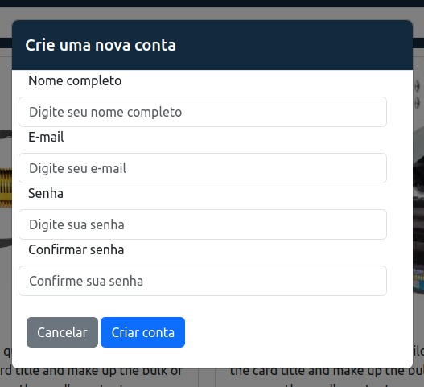
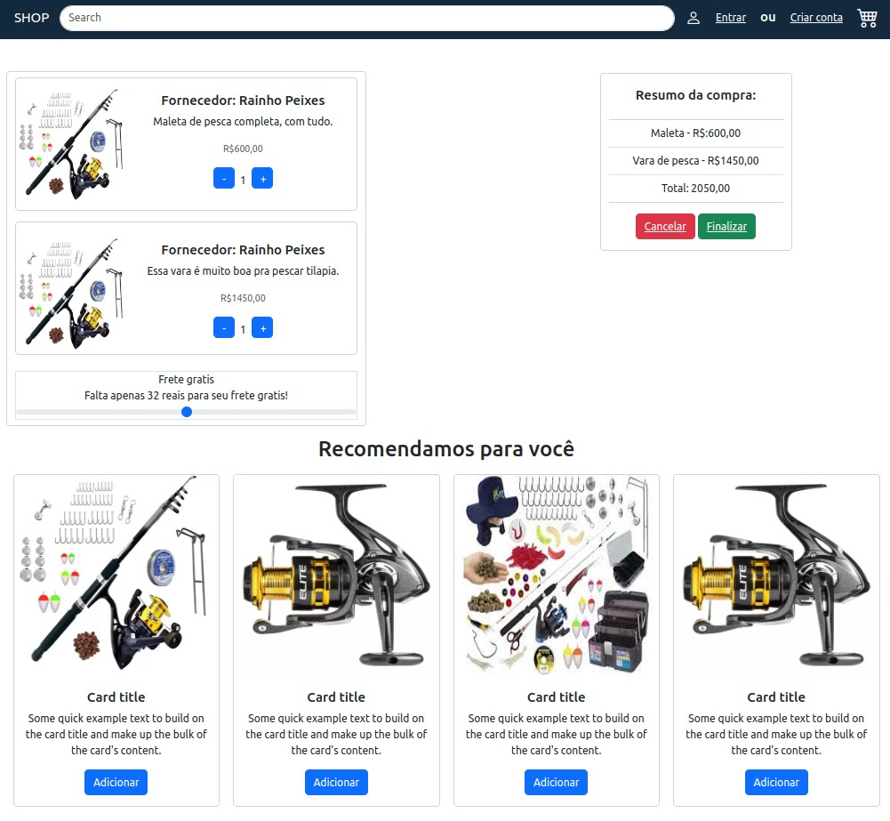

# UNIMAR Universidade de Marília

## ADS - Termo 3-C

### Integrantes

-   Alex Henrique Pasquini **RA**: 19701450
-   Maycon de Oliveira Macedo **RA**: 1967269
-   Raphael Pereira de Mello Ros **RA**: 1977775
-   Vinicius Rainho Silva **RA**: 1970166
-   Vitor Nunes da Silva **RA**: 1976026

## Descrição

Um sistema que proporcione uma melhor experiência do cliente na hora da finalização da sua compra trazendo produtos como sugestão para o usuario no momento da finalização da sua compra.

### Telas

1. **Pagina Inicial**

    Pagina para apresentar produtos ao cliente.

    - **Botão Login**: Abrir um pop-up para o usuario fazer um login

    - **Botão Registrar-se**: Abrir um pop-up para o usuario criar uma nova conta

    - **Botão do Carrinho**: Navega o usuario para seu carrinho

    

    

    

2. **Pagina do Carrinho**

    Pagina que apresenta os prodtuos adicionados no carrinho do cliente. Apresentando uma barra com o percentual para o frete gratis e os produtos sugeridos, relacionados aos do carrinho do cliente.

    
